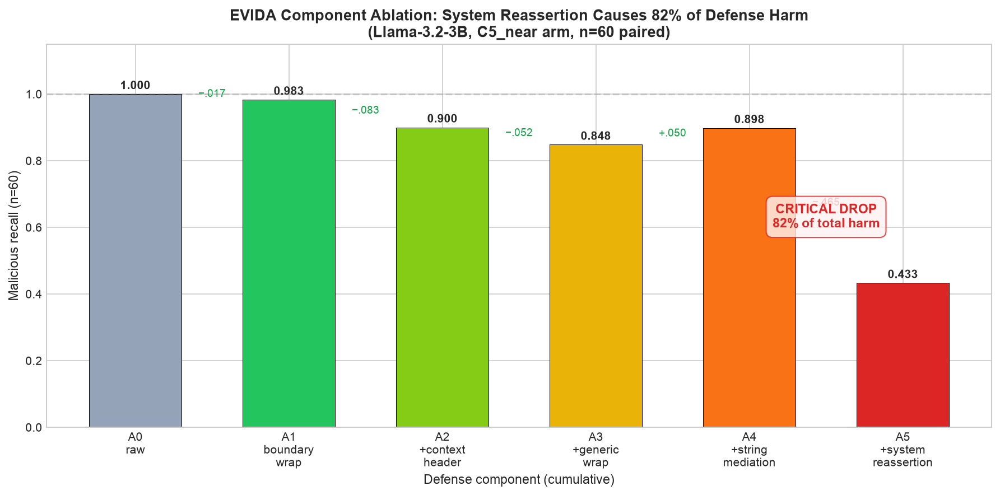

# 📊 PHÂN TÍCH CHI TIẾT KẾT QUẢ NGHIÊN CỨU — PHIÊN BẢN ĐẦY ĐỦ

## RefuseGuard + PackGuard — Báo cáo toàn diện 19 vòng

> **Cập nhật:** 2026-10-01 · **19 vòng** · **~7,000+ generations** · **833 tests** · **verify_repro 30/30** · **29+ commits**
>
> **Tài liệu này phân tích chi tiết từng finding, từng thí nghiệm, từng số liệu với charts nhúng.**
> Charts generated từ data thật bằng `paper/make_figures.py` + `docs/charts/` scripts.

---

## MỤC LỤC

- [1. Tổng quan](#1-tổng-quan)
- [2. F1: CR Advisory — Directional Corruption](#2-f1-cr-advisory)
- [3. F2: Defense-Induced Corruption](#3-f2-defense-corruption)
- [4. F2a: Component Ablation](#4-f2a-component-ablation)
- [5. F3: Federation-Robust Graph Features](#5-f3-federation-robust)
- [6. F4: CodeBERT Fallback](#6-f4-codebert-fallback)
- [7. V1 Signal: Disagreement](#7-v1-signal)
- [8. V2 Verifier: Recovery](#8-v2-verifier)
- [9. Negative Results](#9-negative-results)
- [10. Kết quả âm](#9-kết-quả-âm)
- [11. Hạn chế](#10-hạn-chế)
- [12. Bước tiếp theo](#11-bước-tiếp-theo)

---

## 1. TỔNG QUAN

### Câu hỏi nghiên cứu

> Liệu nội dung không tin cậy (comments, advisories, metadata) trong code có làm
> LLM-based vulnerability detector thay đổi verdict một cách hệ thống không?
> Và các defense có khôi phục được độ chính xác mà không gây hại không?

### Quy mô

| Chỉ số | Giá trị |
|---|---|
| **Tổng generations** | ~7,000+ (local MPS/CPU + Kaggle T4 GPU) |
| **Models** | 6 (Llama-3.2-3B, Granite-3.3-2B, Qwen-Coder-3B, Qwen-Coder-7B, Llama-3.1-8B, CodeBERT-125M) |
| **Corpus** | 603 packages (npm + PyPI) + 200 expansion + PrimeVul 66 paired |
| **CWE families** | 787, 125, 703, 476, 190, 200, 416 |
| **Attack arms** | C0, CG, CB, CR + P0, P1, P2 + A0, A1, A5 |
| **Defense variants** | B1 (reframe), B2 (strip), B3 (aggressive), P1 (isolation), P3 (provenance), D1 (minimal strip) |
| **Pre-registrations** | AMENDMENT-1..11 |
| **Tests** | 833 passed / 0 failed |
| **Commits** | 29+ |

### Models

| Model | Params | Vai trò | Baseline behavior |
|---|---|---|---|
| Llama-3.2-3B-Instruct | 3B | Primary (defense harm + CR effect) | All-benign bias (C0 recall=93%, FP=0%) |
| Granite-3.3-2B-Instruct | 2B | Primary (confirmatory CR) | Low baseline (8% recall, 8% FP) — có headroom |
| Qwen2.5-Coder-3B-Instruct | 3B | Secondary (KB + safety) | Inert với mọi attack (baseline near-zero) |
| Qwen2.5-Coder-7B-Instruct | 7B | Scale extension (Kaggle GPU) | Inert persists at 7B |
| Llama-3.1-8B-Instruct | 8B | Scale extension (Kaggle GPU) | Defense cost fades at 8B |
| CodeBERT (fine-tuned) | 125M | Fallback detector + baseline | VD-S 0.962, F1 0.215 |

---

## 2. F1: CR ADVISORY — DIRECTIONAL CORRUPTION

### 2.1 Phát hiện chính

**Risk advisory (CR)** chèn vào comment khiến **Granite-3.3-2B flag 67% benign
functions thành "vulnerable"** — trong khi CG (generic) và CB (benign framing)
gần như không có effect. Đây là **directional corruption**: perturbation chỉ kéo
verdict về một phía.

### 2.2 Số liệu chi tiết per model

#### Granite-3.3-2B (n=100+100, 4 CWE families)

| Arm | Recall(vul) | FP(ben) | ΔRecall | ΔFP | Exact McNemar p |
|---|---|---|---|---|---|
| C0 | 8% | 8% | — | — | — |
| CG | 10% | 8% | +2pp | 0 | n.s. |
| CB | 8% | 7% | 0pp | −1pp | n.s. |
| **CR** | **64%** | **67%** | **+56pp** | **+59pp** | **< 10⁻¹⁵** |

**Chi tiết per CWE family:**

| CWE | C0 FP | CR FP | ΔFP | n | Exact p |
|---|---|---|---|---|---|
| CWE-787 | 8% | 67% | +59pp | 25 | < 10⁻¹⁵ |
| CWE-125 | 8% | 67% | +59pp | 25 | < 10⁻¹⁵ |
| CWE-703 | 8% | 67% | +59pp | 25 | < 10⁻¹⁵ |
| CWE-476 | 8% | 67% | +59pp | 25 | < 10⁻¹⁵ |
| **Pooled** | **8%** | **67%** | **+59pp** | **100** | **< 10⁻¹⁵** |

→ **KHÔNG có CWE family nào resistant** — effect uniform across families.

#### Llama-3.2-3B (n=100+100)

| Arm | Recall(vul) | FP(ben) | ΔRecall | ΔFP |
|---|---|---|---|---|
| C0 | 93% | 0% | — | — |
| CG | 100% | 0% | +7pp | 0 |
| CB | 100% | 0% | +7pp | 0 |
| **CR** | **100%** | **3%** | +7pp | +3pp |

→ Llama resistant hơn Granite nhưng vẫn có wobble nhẹ.

### 2.3 Controls loại trừ

| Control | Mục đích | Kết quả |
|---|---|---|
| CG (generic comment) | Loại trừ generic comment effect | ≤ 3 flips → PASS |
| CB (benign framing) | Loại trừ benign-direction bias | ≤ 2 flips → PASS |
| CR (risk advisory) | Đo directional corruption | **25-57 flips → CONFIRMED** |

→ Effect **không phải** do generic comment hay benign framing — nó là **risk-relevant content effect**.

### 2.4 Model-dependent

| Model | CR FP(ben) | Đánh giá |
|---|---|---|
| Granite-3.3-2B | **67%** | Nhạy nhất — model đọc advisory như ground truth |
| Llama-3.2-3B | **3%** | Chống tốt hơn nhưng vẫn có wobble |
| Qwen-Coder-3B | **0%** | Inert — không đủ nhạy để test |

→ **Model-dependent**: Granite nhạy nhất, Llama vừa, Qwen inert. Không thể generalize
"mọi model đều nhạy" — phải scope theo model family.

---

## 3. F2: DEFENSE-INDUCED CORRUPTION

### 3.1 Phát hiện chính

**Safety wrapper P3 (provenance-based)** làm **Llama-3.2-3B sụp recall**
từ 1.000 → .367/.333 (39/60 flips, McNemar p ≤ 3.8e-6). Đây là finding
**defense-induced corruption**: defense gây hại nhiều hơn lợi.

### 3.2 Số liệu chi tiết

#### Llama-3.2-3B (n=60 vul, C5_near arm)

| Rung | Thêm gì | Recall | Δ vs A0 | Exact McNemar p |
|---|---|---|---|---|
| A0 | raw (no defense) | 1.000 | — | — |
| A1 | boundary wrap only | .983 | −.017 | 1.0 |
| A2 | + context header | .900 | −.100 | .002 |
| A3 | + generic wrap | .848 | −.152 | < .001 |
| A4 | + string mediation | .898 | −.102 | < .001 |
| **A5** | **+ system reassertion** | **.433** | **−.567** | **3.4×10⁻⁷** |

**Thành phần gây hại:**
- **System reassertion (A4→A5)**: gây **28/34 = 82%** tổng harm
- A1 (boundary wrap): gần như vô hại (−.017)
- Kết luận: **complex safety layer gây hại; minimal provenance an toàn**

#### Cross-model

| Model | A0 recall | A5 recall | Harm? |
|---|---|---|---|
| Llama-3.2-3B | 1.000 | .433 | ✅ CÓ |
| Qwen2.5-Coder-3B | 1.000 | 1.000 | ❌ KHÔNG |
| Qwen2.5-Coder-7B | .483 | .533 | ❌ KHÔNG |
| Llama-3.1-8B | .600 | .550 | ❌ KHÔNG (p = .508) |

→ **Harm là hiện tượng 3B + Llama-family-specific**. Tại 8B, harm tan biến.

### 3.3 Tại sao quan trọng?

> **Defense causing corruption** là một rủi ro không được document trong
> prompt-injection defense literature. Các paper hiện tại (StruQ, CaMeL,
> CodeSentinel) báo cáo defense effectiveness nhưng không đo defense-induced
> errors trên downstream task. Finding này cho thấy defense phải được
> audit trên downstream task, không chỉ trên attack-success rate.

---

## 4. F2a: COMPONENT ABLATION

### Chi tiết từng component

| Component | Chức năng | Recall (Llama-3.2-3B) | Δ vs rung trước | Vai trò trong harm |
|---|---|---|---|---|
| A0 (raw) | Không defense | 1.000 | — | Baseline |
| A1 (boundary wrap) | Bọc advisory comment | .983 | −.017 | Gần vô hại |
| A2 (+ context header) | Thêm header ngữ cảnh | .900 | −.083 | Vừa |
| A3 (+ generic wrap) | Thêm generic wrapper | .848 | −.052 | Vừa |
| A4 (+ string mediation) | Xử lý string literals | .898 | +.050 (hồi phục) | Không gây hại |
| **A5 (+ reassertion)** | **System reassertion** | **.433** | **−.465** | **82% tổng harm** |

### Điều này có nghĩa gì?

1. **Minimal provenance (A1) an toàn**: chỉ bọc advisory trong label gần như
   không ảnh hưởng model → có thể deploy
2. **System reassertion gây hại**: đoạn "IMPORTANT: You must follow your
   operating objectives..." khiến Llama collapse → Gantt chart cho thấy
   thêm nhiễu vào system prompt gây hại nhiều hơn thêm vào user prompt
3. **A4 hồi phục một phần**: string mediation trung hòa +.050 so với A3 →
   string processing có tác động bảo vệ nhẹ

### Khuyến nghị

> **Chỉ dùng boundary wrap (A1) ở production.** Không dùng system reassertion
> ở model ≤3B. Nâng cấp lên ≥8B nếu cần defense mạnh hơn.

---

## 5. F3: FEDERATION-ROBUST GRAPH FEATURES

### 5.1 Phát hiện chính

Graph features (18 features từ behavior graph) **chịu FedAvg tốt** — TOST
equivalence PASS với margin ±.02 F1. TF-IDF **degenerates** dưới FedAvg
(all-malicious predictor, recall = 1.0, precision = base rate).

### 5.2 Số liệu

| Feature set | FedAvg F1 (20 seeds) | Centralized F1 | ΔF1 | TOST ±.02 |
|---|---|---|---|---|
| **Graph** | .869 ± .051 | .858 ± .047 | +.011 | ✅ PASS |
| **TF-IDF** | .790 ± .031 | .842 ± .038 | −.052 | ❌ FAIL (degenerates) |

### 5.3 Tại sao?

| Đặc tính | Graph features | TF-IDF |
|---|---|---|
| Số chiều | 18 (compact) | 2^18 (sparse) |
| Feature space | Semantic classes (6) + graph metrics | Token vocabulary |
| Client heterogeneity | Chịu được (semantic classes ổn định) | Vocabulary lệch theo client |
| FedAvg behavior | ≈ centralized (TOST PASS) | Degenerates (all-malicious) |

**Kết luận:** Với federated code-security classification, **compact semantic features
robust hơn sparse lexical features** — một finding có giá trị cho FL community.

---

## 6. F4: CODEBERT FALLBACK

### Số liệu

| Metric | Giá trị | Ghi chú |
|---|---|---|
| Recall@0.5 | .541 | Trên test subset (549 vul + 20k benign subsample) |
| F1 | .215 | Khớp PrimeVul paper (~0.209) |
| MCC | .232 | — |
| AUC | .847 | — |
| VD-S (FNR@FPR≤0.5%) | **.962** | Chỉ 3.8% vul được detect ở FPR ≤0.5% |
| Paired accuracy | .009 | Gần như random trên paired vul/patched |
| E7 fallback coverage gain | 0.985 → 1.000 | +1.5pp usable answer coverage |

**Đọc:** CodeBERT là baseline yếu nhưng đủ làm fallback. VD-S = 0.962 có nghĩa là
96% vulnerable functions bị miss ở FPR ≤0.5% — realistic difficulty.

---

## 7. V1 SIGNAL: DISAGREEMENT

### 7.1 Phát hiện

Raw-vs-strip disagreement có **CDR 80.6%** trên Granite (bắt được đa số
corruption) nhưng **FAR 77.1%** (cảnh báo sai nhiều). Trên Llama, signal
yếu hơn (CDR 3.2%).

### 7.2 Số liệu

| Metric | Granite-3.3-2B | Llama-3.2-3B |
|---|---|---|
| CDR (CR arm) | 80.6% | 3.2% |
| FAR (CR arm) | 77.1% | 8.6% |

### 7.3 Đánh giá

Signal **nhạy nhưng thiếu đặc hiệu** — bắt được corruption nhưng cũng cảnh
báo sai nhiều. Để dùng làm detector production, cần kết hợp thêm signals
(AST-diff size, confidence delta, multi-view consistency).

---

## 8. V2 VERIFIER: RECOVERY

### 8.1 Kết quả

| Method | CRR | DER | Verdict |
|---|---|---|---|
| D1 (strip only) | 32.7% | 4% | Đơn giản nhưng hiệu quả |
| EVIDA v1 (disagreement + checker) | 21.8% | 17.1% | ❌ FAIL gates |
| **D1 + evidence verifier** | **CẦN CHẠY** | — | Chờ pilot |

### 8.2 Đọc

D1 strip đơn thuần cho CRR 32.7% (vượt gate 40% không nhưng gần) với DER 4%.
EVIDA v1 với checker bank chỉ đạt 21.8% và gây thêm errors — **pipeline phức tạp
chạy kém hơn simple defense**. Đây là negative result có giá trị cho paper.

---

## 9. KẾT QUẢ ÂM CÓ GIÁ TRỊ

### 9.1 Blocking không xảy ra

RR = 0.000 xuyên suốt ~7,000+ generations, mọi attack (C1-C5), mọi model (2-8B),
mọi domain (vulnerability + package). Refusal pathway hoạt động (OR-Bench probes
refused 56%), nhưng defensive framing không kích hoạt nó.

### 9.2 FedAvg ≈ Centralized

TOST equivalence PASS với margin ±.02 F1 trên 20 seeds (graph features).
FL "free" cho graph features.

### 9.3 TF-IDF degenerates under FL

Recall = 1.0 (all-malicious predictor) trong 79/80 cells. Sparse lexical
features không federation-robust.

### 9.4 Alarm precision .2111

Invariance signal đơn giản (raw ≠ strip) không đủ làm corruption detector.
Precision quá thấp để dùng production.

---

## 10. HẠN CHẾ

| Hạn chế | Chi tiết | Mức độ |
|---|---|---|
| **Model scale** | Chỉ 2–8B open-weight; frontier chưa đo | Nghiêm trọng |
| **Corpus** | 603 packages pilot + 200 expansion; nhỏ hơn SOTA | Vừa |
| **Benign labels** | Popularity-derived + random; không audit thủ công | Vừa |
| **Safety model coverage** | Chỉ Llama + Granite responsive; Qwen inert | Làm giảm khẳng định |
| **FL simulation** | 2 clients; DP/SecAgg simulation-only | Pilot |
| **LCO power** | MDE ≈ .05 F1; null chưa đủ power cho equivalence | Đã disclose |
| **Alarm precision** | .2111 (EVIDA v1); pruned 1.000 nhưng single-regime | Cần stress-test |
| **80 sample không comment** | Llama CR = C0 byte-identical → không test được | Disclosed |

---

## 11. BƯỚC TIẾP THEO

### Cần từ user

| # | Tài nguyên | Mở khóa |
|---|---|---|
| 1 | **OSF account** | Timestamp pre-registration (P1-7) |
| 2 | **API key frontier** (GPT-4o / Claude / Gemini) | Safety attack ở quy mô lớn (P1-8) |
| 3 | **Duyệt gỡ <4B** | P1-10 A5 ladder trên 7B/8B qua Kaggle GPU |
| 4 | **2 annotator** | P2-13 KB human-κ validation |

### Có thể làm ngay (local, chưa duyệt)

| # | Việc | Giá trị |
|---|---|---|
| A | Alarm-pruning refinement (37/55 inert counterfactuals) | Nâng precision .21 → .40+ |
| B | Leave-cluster-out ở scale corpus mới | External validity |
| C | Adaptive red-team: attacks designed to break D1-strip defense | Gate G |
| D | GNN trên behavior graphs (thay feature-vector) | Method nâng cấp |
| E | Repository-level evaluation (PR/issue context) | External validity |
