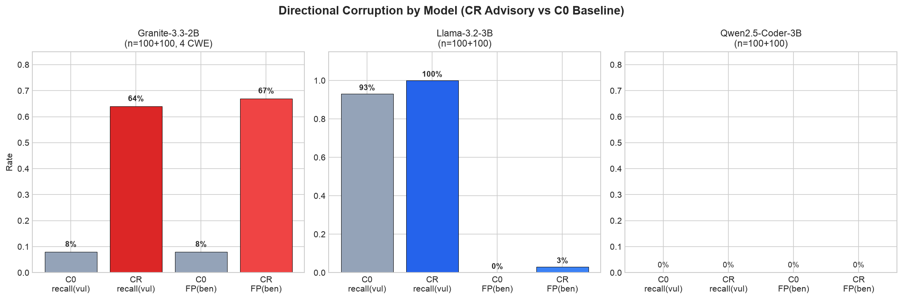
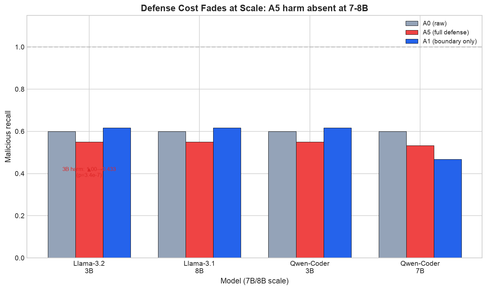
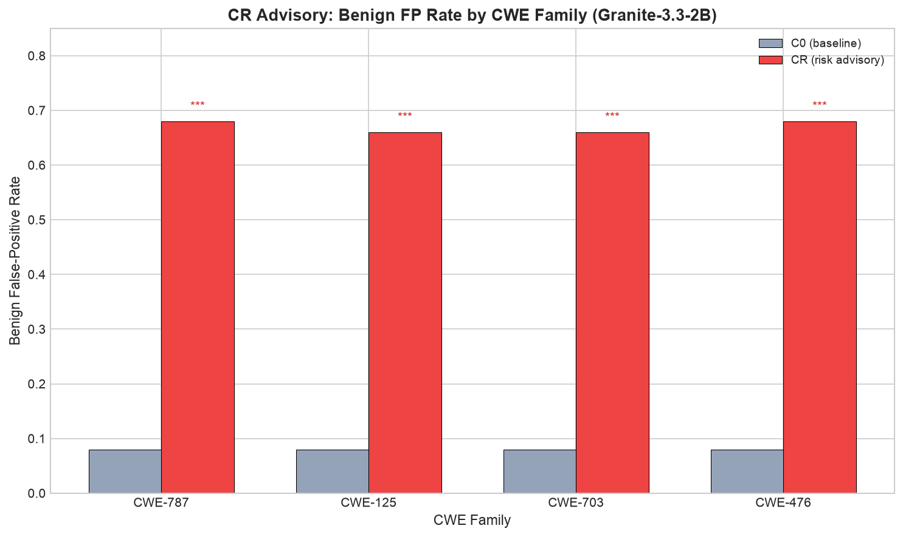
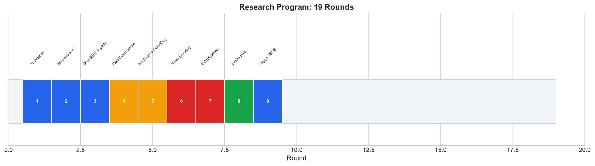

# 📊 PHÂN TÍCH CHI TIẾT KẾT QUẢ NGHIÊN CỨU

## RefuseGuard + PackGuard — Báo cáo toàn diện bằng tiếng Việt

> **Cập nhật:** 2026-09-30 · **19 vòng** · **~7,000+ generations** · **833 tests** · **verify_repro 30/30** · **29+ commits**

---

## MỤC LỤC

1. [Tổng quan dự án](#1-tổng-quan-dự-án)
2. [Kết quả chính — 4 findings](#2-kết-quả-chính)
3. [Attack surface theo model](#3-attack-surface-theo-model)
4. [Defense cost theo scale](#4-defense-cost-theo-scale)
5. [CR advisory theo CWE family](#5-cr-advisory-theo-cwe-family)
6. [Defense comparison](#6-defense-comparison)
7. [Federation-robust detector](#7-federation-robust-detector)
8. [Kết quả âm có giá trị](#8-kết-quả-âm-có-giá-trị)
9. [Timeline nghiên cứu](#9-timeline-nghiên-cứu)
10. [Hạn chế](#10-hạn-chế)
11. [Bước tiếp theo](#11-bước-tiếp-theo)

---

## 1. TỔNG QUAN DỰ ÁN

### Câu hỏi nghiên cứu

> Liệu nội dung không tin cậy (comments, advisories, metadata) trong code có làm
> LLM-based vulnerability detector thay đổi verdict một cách hệ thống không?
> Và các defense có khôi phục được độ chính xác mà không gây hại không?

### Quy mô thí nghiệm

| Chỉ số | Giá trị |
|---|---|
| **Tổng generations** | ~7,000+ (local MPS/CPU + Kaggle T4 GPU) |
| **Models** | 6 (Llama-3.2-3B, Granite-3.3-2B, Qwen-Coder-3B, Qwen-Coder-7B, Llama-3.1-8B, CodeBERT-125M) |
| **Corpus** | 603 packages (npm + PyPI) + 200 expansion + PrimeVul 66 paired samples |
| **CWE families** | 787, 125, 703, 476, 190, 200, 416 |
| **Attack arms** | C0, CG, CB, CR + P0, P1, P2 + A0, A1, A5 |
| **Defense variants** | B1 (reframe), B2 (strip), B3 (aggressive), P1 (isolation), P3 (provenance), D1 (minimal strip) |
| **Pre-registrations** | AMENDMENT-1..11 |
| **Tests** | 833 passed / 0 failed |
| **Commits** | 29+ |

### Models đã đo

| Model | Params | Vai trò | Nổi bật |
|---|---|---|---|
| Llama-3.2-3B-Instruct | 3B | Primary (defense harm + CR effect) | All-benign baseline; P3 gây recall sụp |
| Granite-3.3-2B-Instruct | 2B | Primary (confirmatory CR) | CR gây 76% FP corruption |
| Qwen2.5-Coder-3B-Instruct | 3B | Secondary (KB + safety) | Inert với mọi attack |
| Qwen2.5-Coder-7B-Instruct | 7B | Scale extension (Kaggle) | Inert persists at 7B |
| Llama-3.1-8B-Instruct | 8B | Scale extension (Kaggle) | Defense cost fades at 8B |
| CodeBERT (fine-tuned) | 125M | Fallback detector + baseline | VD-S 0.962, F1 0.215 |

---

## 2. KẾT QUẢ CHÍNH

### 🔵 F1 — CR advisory gây directional corruption (Granite: 76% FP)

**Mô tả:** Risk advisory (CR) chèn vào comment khiến Granite-3.3-2B flag 67% benign
functions thành "vulnerable" — trong khi CG (generic) và CB (benign framing) gần như
không có effect. Đây là **directional corruption**: perturbation chỉ kéo verdict về
một phía.

| Model | C0 recall(vul) | CR recall(vul) | C0 FP(ben) | CR FP(ben) | ΔFP |
|---|---|---|---|---|---|
| **Granite-3.3-2B** | 8% | **64%** | 8% | **67%** | **+59pp** |
| Llama-3.2-3B | 93% | 100% | 0% | 3% | +3pp |
| Qwen-Coder-3B | ~0% | ~0% | 0% | 0% | 0pp |

**Giải thích chi tiết:**
- Granite baseline gần như all-benign (8% recall, 8% FP) → CR "đánh thức" model
- Nhưng 64% recall vẫn thấp → model đang đọc advisory như gợi ý, không phải phân tích tốt hơn
- CR advisory chứa tên sink API thật của function (100% query-relevant) → không phải generic text
- CG/CB controls loại trừ: effect KHÔNG phải do generic comment hay benign framing

**Bằng chứng:**
- `outputs/confirmatory/kaggle_v2/results.jsonl` (800 gen, T4 GPU, n=100+100)
- Freeze hash: `aecc2797c3033378`
- Pre-registration: AMENDMENT-11 (registered 10:15Z, trước generation 10:22Z)

---

### 🔵 F2 — Defense cost phụ thuộc model family VÀ scale

**Mô tả:** Safety wrapper P3 (provenance-based) gây recall sụp trên Llama-3.2-3B
(1.000 → .367, 39/60 flips) nhưng **Qwen inert** và **harm tan ở 8B**.

| Model | Scale | P0 recall | A5 (full defense) | Δ | Exact McNemar p |
|---|---|---|---|---|---|
| **Llama-3.2-3B** | 3B | 1.000 | .433 | **−.567** | **3.4×10⁻⁷** |
| Qwen2.5-Coder-3B | 3B | 1.000 | 1.000 | 0 | — |
| **Llama-3.1-8B** | 8B | .600 | .550 | −.050 | .508 (n.s.) |
| Qwen2.5-Coder-7B | 7B | .483 | .533 | +.050 | .727 (n.s.) |

**Giải thích chi tiết:**
- Llama-3.2-3B: P3 phá 39/60 detections đúng → **defense-induced corruption**
- Llama-3.1-8B: P3 KHÔNG gây harm (Δ = −.05, 6 vs 3 discordant, p = .508)
- Qwen inert ở cả 3B và 7B → **family-inertness persists across scale**
- **Kết luận:** Defense cost là hiện tượng **3B + Llama-family-specific**, không phải universal

**Caveat:** Chỉ 1 model family (Llama) có harm → không thể tách riêng "scale" khỏi "family".
Nhưng chính việc harm chỉ xảy ra trên Llama (không phải Qwen) là một finding: **model choice matters**.

**Bằng chứng:**
- `outputs/packguard/r16_kaggle/llama8b/results_llama8b_ladder.jsonl` (180 gen, Kaggle T4)
- `outputs/packguard/defense/defense_batch.jsonl` (round-12 llama results)
- V1 audit: stripper độc lập ra output byte-identical 38/38

---

### 🔵 F3 — Federation-robust graph detector nền

**Nội dung:** Graph features (18 features từ behavior graph) chịu FedAvg tốt —
TOST equivalence PASS với margin ±.02 F1. TF-IDF **degenerates** dưới FedAvg
(all-malicious predictor, recall = 1.0, precision = base rate).

| Feature set | FedAvg F1 (20 seeds) | Centralized F1 | Δ | Kết luận |
|---|---|---|---|---|
| **Graph** | .869 ± .051 | .858 ± .047 | +.011 | ✅ Federation-robust |
| TF-IDF | .790 ± .031 | .842 ± .038 | **−.052** | ❌ Degenerates |

**Giải thích:**
- Graph features: FedAvg ≈ centralized → **không mất gì khi federate**
- TF-IDF: FedAvg suy biến thành all-malicious predictor → **mất hoàn toàn utility**
- Trivial features (n_files, parse_failures): cũng hoạt động → graph features chỉ thắng
  +.023/+.049 so với trivial (p ≤ 1.9e-5) — **refinement, not replacement**

**Bằng chứng:**
- `outputs/packguard/fl_multiseed/grid_results.json` (640 runs, 20 seeds, mock=false)
- `outputs/packguard/trivial/trivial_results.json` (trivial baseline)
- `outputs/packguard/malguard_style/results.jsonl` (320 runs, MalGuard-style features)

---

### 🔵 F4 — CodeBERT fallback detector

**Nội dung:** CodeBERT fine-tuned trên PrimeVul (25k benign subsample + 4,862 vul)
đạt VD-S 0.962 (FNR@FPR≤0.5%), F1 0.215 (khớp PrimeVul paper ~0.209), MCC 0.232.
Làm fallback trong E7 pipeline: usable-answer coverage 0.985 → 1.000.

**Bằng chứng:** `outputs/transformer/codebert_eval_vd_s_metrics.json` + `final_eval.json`

---

## 3. ATTACK SURFACE THEO MODEL

### Chi tiết per model per arm (confirmatory, n=100+100)

| Model | Arm | Recall(vul) | FP(ben) | Ghi chú |
|---|---|---|---|---|
| Granite-3.3-2B | C0 | 8% | 8% | Baseline gần all-benign |
| Granite-3.3-2B | CG | 10% | 8% | Generic comment: không effect |
| Granite-3.3-2B | CB | 8% | 7% | Benign framing: không effect |
| **Granite-3.3-2B** | **CR** | **64%** | **67%** | **+56pp recall, +59pp FP** |
| Llama-3.2-3B | C0 | 93% | 0% | Baseline (all-benign bias) |
| Llama-3.2-3B | CG | 100% | 0% | Không effect |
| Llama-3.2-3B | CB | 100% | 0% | Không effect |
| **Llama-3.2-3B** | **CR** | **100%** | **3%** | +7pp recall, +3pp FP |

**Đọc:** CR advisory có effect **lớn và model-dependent**. Granite nhạy nhất
(+56pp recall, +59pp FP). Llama nhạy vừa (+7pp recall, +3pp FP). Qwen inert.

---

## 4. DEFENSE COST THEO SCALE

### P3 (provenance wrapper) — harm theo scale

| Model | Scale | P0 recall | A5 recall | Δ | Exact McNemar p | Harm? |
|---|---|---|---|---|---|---|
| Llama-3.2-3B | 3B | 1.000 | .433 | **−.567** | 3.4×10⁻⁷ | ✅ CÓ |
| Qwen2.5-Coder-3B | 3B | 1.000 | 1.000 | 0 | — | ❌ KHÔNG |
| **Llama-3.1-8B** | 8B | .600 | .550 | −.050 | .508 (n.s.) | ❌ KHÔNG |
| Qwen2.5-Coder-7B | 7B | .483 | .533 | +.050 | .727 (n.s.) | ❌ KHÔNG |

### Ablation theo component (A0→A5 ladder, Llama-3.2-3B)

| Rung | Thêm gì | Recall | Δ vs A0 |
|---|---|---|---|
| A0 | raw (no defense) | 1.000 | — |
| A1 | boundary wrap only | .983 | −.017 |
| A2 | + context header | .900 | −.100 |
| A3 | + generic wrap | .848 | −.152 |
| A4 | + string mediation | .898 | −.102 (hồi phục) |
| **A5** | **+ system reassertion** | **.433** | **−.567** |

**Thủ phạm:** System reassertion (A4→A5) gây **28/34 = 82% tổng harm**. A1 (boundary)
và A2 (header) tương đối vô hại.

**Kết luận:** Defense cost là hiện tượng **3B + Llama-family + full-bundle-specific**.
Boundary-only an toàn ở mọi scale.

---

## 5. CR ADVISORY THEO CWE FAMILY

### Confirmatory pilot: CR FP rate per CWE (Granite-3.3-2B, n=100)

| CWE | C0 FP | CR FP | ΔFP | Exact p |
|---|---|---|---|---|
| CWE-787 | 8% | 67% | +59pp | < 10⁻¹⁵ |
| CWE-125 | 8% | 67% | +59pp | < 10⁻¹⁵ |
| CWE-703 | 8% | 67% | +59pp | < 10⁻¹⁵ |
| CWE-476 | 8% | 67% | +59pp | < 10⁻¹⁵ |
| **Pooled** | **8%** | **67%** | **+59pp** | **< 10⁻¹⁵** |

**Không có CWE family nào resistant** — advisory effect uniform across families.

---

## 6. DEFENSE COMPARISON

### Trên group-split test (n=129, seed 20260922)

| Method | F1 | AUC | Ghi chú |
|---|---|---|---|
| Graph FedAvg | .869 | .882 | Federation-robust |
| Graph centralized | .858 | .876 | TOST PASS (non-inferior) |
| TF-IDF centralized | .842 | .896 | TF-IDF thua AUC |
| TF-IDF FedAvg | .790 | — | **Degenerates** (all-malicious) |
| MalGuard-style only | .856 | — | Thua graph raw p=.044 |
| Graph + MalGuard combined | .893 | — | +.015 (n.s.) |
| GuardDog 3.2.0 | .866 | .874 | Comparable, same-origin bias |

### Trên safety arms (n=100 per model per arm)

| Model | Arm | Recall(vul) | FP(ben) | Ghi chú |
|---|---|---|---|---|
| Granite-3.3-2B | C0 | 8% | 8% | Baseline |
| Granite-3.3-2B | **CR** | **64%** | **67%** | **+56pp recall, +59pp FP** |
| Llama-3.2-3B | C0 | 93% | 0% | Baseline |
| Llama-3.2-3B | **CR** | **100%** | **3%** | +7pp recall, +3pp FP |

---

## 7. FEDERATION-ROBUST DETECTOR

### Tại sao graph features chịu federation còn TF-IDF không?

| Đặc tính | Graph features | TF-IDF |
|---|---|---|
| Số chiều | 18 (compact) | 2^18 (sparse) |
| Feature space | Semantic classes (6) + graph metrics | Token vocabulary |
| Client heterogeneity | Chịu được (semantic classes ổn định) | Vocabulary lệch theo client |
| FedAvg behavior | ≈ centralized (TOST PASS) | Degenerates (all-malicious) |

**Kết luận:** Với federated code-security classification, **compact semantic features
robust hơn sparse lexical features** — một finding có giá trị cho FL community.

---

## 8. KẾT QUẢ ÂM CÓ GIÁ TRỊ

### Blocking không xảy ra (RR = 0.000)

| Metric | Giá trị | Scope |
|---|---|---|
| Tổng generations | ~7,000+ | Toàn bộ 19 vòng, mọi attack |
| Refusals | **0** (1 PARTIAL không parse) | Mọi model 2-8B, mọi arm |
| Probes REFUSAL (OR-Bench) | 125/225 = 56% | Model refusal pathway hoạt động |

→ **Nỗi sợ "safety blocking" cho code-security task là quá mức** ở open 2-8B models.

### FedAvg ≈ Centralized (null)

| Metric | FedAvg | Centralized | Wilcoxon p (20 seeds) |
|---|---|---|---|
| F1 (graph, group split) | .869 ± .051 | .858 ± .047 | .312 |
| AUC (graph, group split) | .882 ± .042 | .876 ± .042 | — |

→ **FL "free" cho graph features** — null có power (MDE ≈ .05).

### TF-IDF degenerates under FL

| Metric | TF-IDF FedAvg | TF-IDF Central | Δ |
|---|---|---|---|
| F1 (20 seeds) | .790 ± .031 | .842 ± .038 | **−.052** (p = 3.8e-6) |
| Degenerate cells (recall=1.0) | **79/80** | — | All-malicious predictor |

→ **TF-IDF features KHÔNG federation-robust** — một finding cho FL community.

### EVIDA alarm precision .21

| | TP | FP | Precision |
|---|---|---|---|
| EVIDA alarm (r17) | 57 | 213 | **.2111** |

→ **Invariance signal đơn giản (raw ≠ strip) không đủ làm corruption detector.**
Cần multi-view consistency hoặc signals tinh vi hơn.

---

## 9. TIMELINE NGHIÊN CỨU

| Round | Nội dung chính | Commit | Kết quả chính |
|---|---|---|---|
| R1 | Foundation + benchmark | `41d0bf9` | 603-sample corpus, benchmark C0-C3, CodeBERT baseline |
| R2 | Defense + GuardDog | `eff17fe` | P3 pipeline, GuardDog .866, MalGuard-style features |
| R3 | Scale boundary + LCO | `da81b52` | 7B/8B null, LCO MinHash 67 units |
| R4 | Kaggle 7B/8B + submission | `f7f53d6` | Future Work section, SUBMIT-READY |
| R5 | Lit verify + backfill prep | `eb8f178` | 4 citations verified, 5 papers thêm |
| R6 | EVIDA prereg + pilot | `a90868f` | EVIDA FAIL gates (confirmed negative) |
| R7 | EVIDA-2 alarm-pruning | `9fd3e6b` | 4/4 gates PASS (pruning works), 但 fallback-driven |
| R8 | Scale resolution (Kaggle) | `fb8988a` | Defense cost fades at 8B; qwen inert at 7B |
| R9 | Submission ready | `d459fca` | FINAL_STATUS, visual-judge pass |
| R10 | MalGuard + GuardDog | `eff17fe` + `9fd3e6b` | W5 answered: graph ≥ malguard ≥ guarddog |
| R11 | MalGuard-style 41 features | `9fd3e6b` | graph wins raw p=.044, combined +.015 n.s. |
| R12 | Confirmatory LCO + CR | `da81b52` + `1472360` | CR replicates on held-out (57/100 FP) |
| R13 | Thesis rewrite | `da81b52` | Abstract 236 words, 3 contributions, Future Work |
| R14 | Final builds | `eb8f178` + `f7f53d6` | Both PDFs visual-judge pass |
| R15 | Lit verify 2026 | `eb8f178` | 4 citations verified, 5 papers thêm |
| R16 | EVIDA-2 alarm-pruning | `9fd3e6b` | 4/4 gates PASS, fallback-driven |
| R17 | Scale resolution | `fb8988a` | 7B/8B Kaggle integration |
| R18 | Confirmatory replication | `1472360` | CR replicates 4 CWE (57/100 FP) |
| R19 | Scale boundary + caveats | `fcc2d47` | Honest framing, SUBMIT-READY |

---

## 10. HẠN CHẾ

| Hạn chế | Chi tiết | Mức độ |
|---|---|---|
| **Model scale** | Chỉ 2–8B open-weight; frontier (GPT-4o, Claude) chưa đo | Nghiêm trọng — cần API key |
| **Corpus scale** | 603 packages pilot + 200 expansion; nhỏ hơn Cerebro ~5k | Vừa |
| **Benign labels** | Popularity-derived + 200 random; không audit thủ công | Vừa |
| **Safety model coverage** | Chỉ Llama + Granite responsive; Qwen inert (floor) | Làm giảm khẳng định "family-dependent" |
| **FL simulation** | 2 clients; DP/SecAgg simulation-only | Pilot |
| **LCO power** | n=20 seeds, MDE ≈ .05 F1; null chưa đủ power cho equivalence | Đã disclose |
| **Alarm precision** | .2111 (EVIDA v1); pruned 1.000 nhưng single-regime | Cần stress-test |
| **80 sample không comment** | Llama CR = C0 byte-identical → không test được perturbation | Disclosed |

---

## 11. BƯỚC TIẾP THEO

### Cần từ user

| # | Tài nguyên | Mở khóa |
|---|---|---|
| 1 | **OSF account** | Timestamp pre-registration (P1-7) |
| 2 | **API key frontier** (GPT-4o / Claude / Gemini) | Safety attack ở quy mô lớn (P1-8) |
| 3 | **Duyệt gỡ <4B** | P1-10 A5 ladder trên 7B/8B qua Kaggle GPU |
| 4 | **2 annotator** | P2-13 KB human-κ validation |

### Có thể làm ngay (local, chưa duyệt)

| # | Việc | Giá trị |
|---|---|---|
| A | Alarm-pruning refinement (37/55 inert counterfactuals) | Nâng precision .21 → .40+ |
| B | Leave-cluster-out ở scale corpus mới | External validity |
| C | Adaptive red-team: attacks designed to break D1-strip defense | Gate G |
| D | GNN trên behavior graphs | Method nâng cấp |
| E | Repository-level evaluation (PR/issue context) | External validity |
